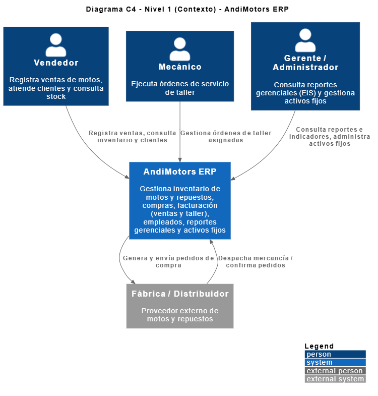
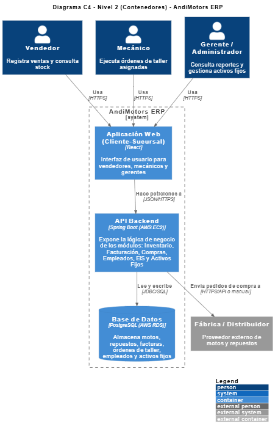

[← Volver al índice](arc42-template-ES.md)

# 3. Alcance y Contexto del Sistema

## 3.1 Contexto de negocio

El equipo agregó, después de los 11 diagramas UML originales, un [diagrama de contexto C4 (Nivel 1)](../diagramas/plantuml/diagrama_c4_contexto.plantuml) dedicado, que se toma como fuente principal de esta sección junto con la [Vista de Escenarios](<../../Vista de Procesos (4+1)/Vista de escenarios.jpg>) y el [diagrama de clases](../diagramas/plantuml/diagrama_clases.plantuml) original.

Actores/roles que interactúan con AndiMotors ERP (nombres tal como aparecen en cada fuente; ver equivalencias completas en [01.4 Stakeholders](01_introduction_and_goals.md#14-stakeholders)):

| Actor | Interacción con el sistema | Fuente |
|---|---|---|
| Cliente | Adquiere motos y/o repuestos, o solicita servicio de taller; consulta catálogo y agenda servicio técnico. | Diagrama de clases, C4 contexto (implícito vía Vendedor), Vista de Escenarios. |
| Vendedor | Registra ventas, consulta stock y clientes; único rol autorizado a facturar ventas (RNF-2). | Diagrama de clases, C4 contexto, Vista de Escenarios. |
| Mecánico / Técnico | Atiende órdenes de taller y registra diagnósticos; autorizado a cerrar órdenes de servicio junto al Jefe de taller (RNF-2). | Diagrama de clases (`Mecanico`), Vista de Escenarios (`Técnico`). |
| Jefe de taller | Autorizado a cerrar órdenes de servicio (RNF-2). Resuelto como valor del atributo `rol` de `Usuario` (ver [AD-09](09_architecture_decisions.md#ad-09--autenticación-y-autorización-basada-en-la-entidad-usuario)). | RNF-2 únicamente; no modelado como clase/actor en ningún diagrama. |
| Gerente / Administrador | Consulta reportes gerenciales (EIS) y gestiona activos fijos. | C4 contexto (`gerente`), Vista de Escenarios (`Administrador`), `product-backlog.md` (HU-05, HU-11, HU-19, HU-20, rol "gerente"). |
| Jefe de Compras | Registra compras a proveedor. | Vista de Escenarios; equivalente a "encargado de compras"/"encargado de bodega" en `product-backlog.md` y `sprint-1-planning.md`. |
| Fábrica / Distribuidor (Proveedor) | Sistema/actor externo: recibe pedidos de compra y despacha mercancía. | C4 contexto (`System_Ext`), Vista Lógica (clase `Proveedor`), Vista de Escenarios (actor `Proveedor`). **No modelado** en el diagrama de componentes ni en `diagrama_clases.plantuml` originales — ver [11. Riesgos — R-11](11_risks_and_technical_debt.md#r-11--integración-con-dian-y-proveedores-modelada-en-diagramas-nuevos-pero-ausente-en-los-diagramas-originales). |
| DIAN | Actor/sistema externo: recibe la solicitud de facturación electrónica y devuelve el CUFE. | Vista Lógica, Vista de Procesos, Vista Física, Vista de Escenarios. **No modelado** en el C4 de contexto ni en los diagramas originales — ver [11. Riesgos — R-11](11_risks_and_technical_debt.md#r-11--integración-con-dian-y-proveedores-modelada-en-diagramas-nuevos-pero-ausente-en-los-diagramas-originales). |

⚠️ El diagrama C4 de contexto solo modela **Fábrica/Distribuidor** como sistema externo; no incluye a **DIAN**, que sí aparece en la Vista Lógica, la Vista de Procesos, la Vista Física y la Vista de Escenarios. Esto sugiere que el C4 de contexto se agregó antes que la Vista 4+1, y no se actualizó después para incluir DIAN — inconsistencia documentada en [11. Riesgos y Deuda Técnica](11_risks_and_technical_debt.md).

Entre módulos internos, el [diagrama de componentes](../diagramas/plantuml/diagrama_componentes.plantuml) original documenta las siguientes dependencias de negocio:

- Facturación consume `verificarDisponibilidad()` y `descontarRepuesto()` de Inventario, y `consultarComision()` de Empleados.
- Empleados consume `asignarMecanico()` de Facturación.
- Compras consume `consultarHistoricoVentas()` de EIS.

La Vista de Escenarios agrega además las siguientes relaciones de negocio con actores externos, no presentes en el diagrama de componentes original:

- "Registrar venta" **«include»** "Generar factura electrónica" → actor DIAN.
- "Registrar compra a proveedor" → actor Proveedor.

## 3.2 Contexto técnico

> **Nota**: el contexto técnico descrito a continuación corresponde a la **arquitectura de despliegue propuesta**, documentada como ejercicio del taller. El sistema **no está desplegado en la nube**; para desarrollo y demostración académica se ejecuta localmente (ver [07. Vista de Despliegue](07_deployment_view.md)).

El repositorio contiene **dos generaciones** de contexto técnico propuesto, con distinto nivel de detalle:

**(a) Diagrama de despliegue original** ([diagrama_despliegue.plantuml](../diagramas/plantuml/diagrama_despliegue.plantuml)):

| Origen | Destino | Canal/Protocolo propuesto |
|---|---|---|
| Cliente - Sucursal (Frontend React) | Servidor Cloud (API Backend Spring Boot, AWS EC2 — propuesto) | HTTPS |
| Servidor Cloud (API Backend Spring Boot) | Servidor BD (PostgreSQL - AndinaMotorsDB, AWS RDS — propuesto) | TCP/5432 |

**(b) Vista Física** ([`4. vista fisica.jpg`](<../../Vista de Procesos (4+1)/4. vista fisica.jpg>)) y [diagrama de contenedores C4](../diagramas/plantuml/diagrama_c4_contenedores.plantuml), agregadas después, con más detalle:

| Origen | Destino | Canal/Protocolo propuesto |
|---|---|---|
| Navegador Cliente | Load Balancer | HTTPS |
| App Móvil (Vendedores) | Load Balancer | HTTPS |
| Load Balancer | Servidor de Aplicaciones (API REST) | HTTP interno |
| Servidor de Aplicaciones | Servidor de Base de Datos (PostgreSQL) | TCP/5432 |
| Servidor de Aplicaciones | Servidor de Reportes | HTTP interno |
| Servidor de Aplicaciones | Sistema Externo DIAN (Facturación Electrónica) | HTTPS (Web Service) |
| Servidor de Aplicaciones | Sistema Proveedores (Compras B2B) | HTTPS (API) |

Todo lo anterior corresponde a un único "Proveedor Cloud (AWS/Azure)" en la Vista Física — nótese que esta fuente deja abierta la nube entre AWS y Azure, mientras que el diagrama de despliegue original y `requisitos/No funcionales.md` especifican AWS exclusivamente (ver [11. Riesgos — R-12](11_risks_and_technical_debt.md#r-12--ambigüedad-de-proveedor-cloud-aws-vs-awsazure-entre-diagramas)).

Sistemas externos ahora modelados (en la Vista Física, la Vista de Escenarios y el C4 de contexto, no en el diagrama de despliegue ni el diagrama de componentes originales): **Sistema Externo DIAN** (facturación electrónica) y **Sistema Proveedores / Fábrica-Distribuidor** (compras B2B). Según [alcance.md](../alcance.md) (actualizado en esta revisión), ambos habían sido declarados inicialmente fuera de alcance y ahora aparecen modelados — ver la nota de evolución de alcance en ese documento y la inconsistencia registrada en [11. Riesgos y Deuda Técnica](11_risks_and_technical_debt.md). El soporte multi-sucursal con sincronización en la nube entre sedes **sigue** fuera de alcance: ninguna de las dos generaciones de diagramas modela más de una sucursal cliente simultánea.

---
[← Anterior: Restricciones de la Arquitectura](02_architecture_constraints.md) · [Volver al índice](arc42-template-ES.md) · [Siguiente: Estrategia de Solución →](04_solution_strategy.md)
