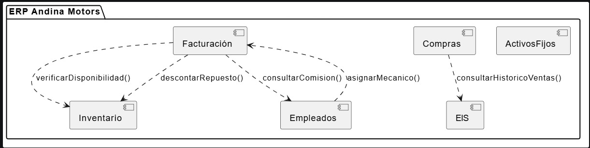
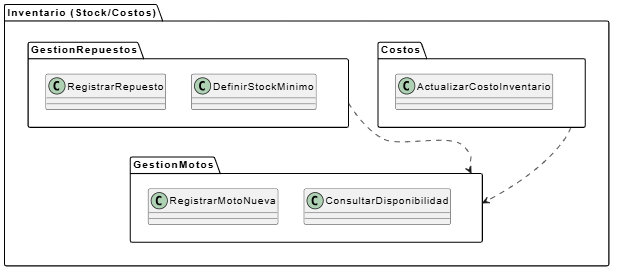
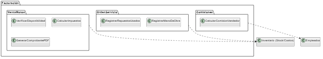
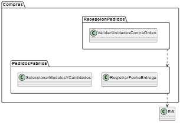
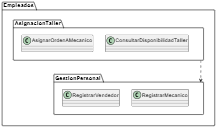
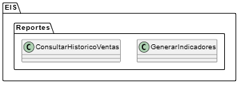
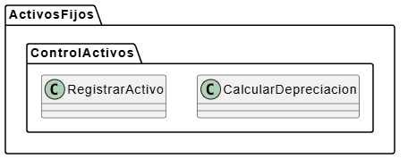
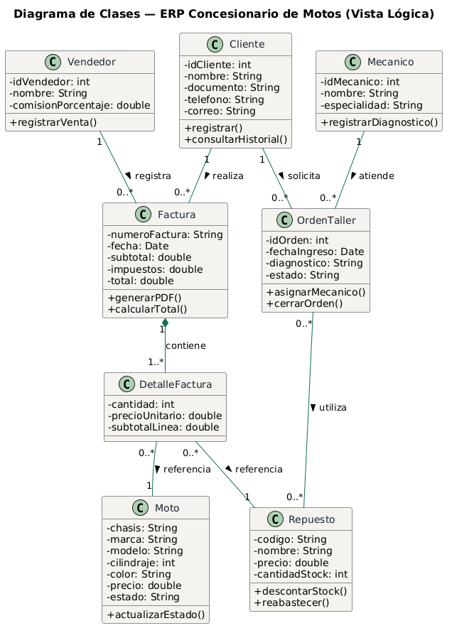
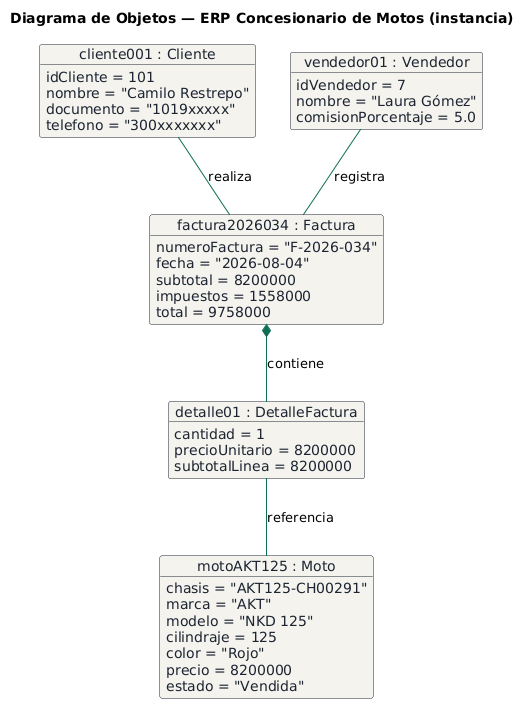

[← Volver al índice](arc42-template-ES.md)

# 5. Vista de Bloques

## 5.1 Sistema general de caja blanca (Nivel 1) — Diagrama de Componentes

**Motivación**: AndiMotors ERP está compuesto por 6 componentes de negocio (uno por módulo), documentados en [diagrama_componentes.plantuml](../diagramas/plantuml/diagrama_componentes.plantuml).

**Bloques de construcción contenidos**: Inventario, Facturación, Compras, Empleados, EIS, ActivosFijos.

**Interfases importantes**:

| Componente origen | Componente destino | Operación |
|---|---|---|
| Facturación | Inventario | `verificarDisponibilidad()` |
| Facturación | Inventario | `descontarRepuesto()` |
| Facturación | Empleados | `consultarComision()` |
| Compras | EIS | `consultarHistoricoVentas()` |
| Empleados | Facturación | `asignarMecanico()` |

### Inventario

- **Propósito/Responsabilidad**: control de stock de motos y repuestos, disponibilidad por sucursal y costos (RF-1).
- **Interfase(s)**: expone `verificarDisponibilidad()` y `descontarRepuesto()`, consumidas por Facturación.

### Facturación

- **Propósito/Responsabilidad**: venta de motos, órdenes de servicio de taller y cálculo de comisiones (RF-2).
- **Interfase(s)**: consume `verificarDisponibilidad()`/`descontarRepuesto()` de Inventario y `consultarComision()` de Empleados; expone `asignarMecanico()`, consumida por Empleados.

### Compras

- **Propósito/Responsabilidad**: pedidos a fábrica/distribuidor y recepción de mercancía (RF-3).
- **Interfase(s)**: consume `consultarHistoricoVentas()` de EIS.

### Empleados

- **Propósito/Responsabilidad**: registro de vendedores y mecánicos, asignación de órdenes de taller (RF-4).
- **Interfase(s)**: expone `consultarComision()`, consumida por Facturación; consume `asignarMecanico()` de Facturación.

### EIS

- **Propósito/Responsabilidad**: reportes e indicadores gerenciales (histórico de ventas).
- **Interfase(s)**: expone `consultarHistoricoVentas()`, consumida por Compras.

### ActivosFijos

- **Propósito/Responsabilidad**: registro de activos y cálculo de depreciación.
- **Interfase(s)**: [PENDIENTE: el diagrama de componentes no modela dependencias entrantes/salientes de ActivosFijos con otros módulos].

## 5.2 Caja blanca por componente (Nivel 2) — Diagramas de Paquetes

Cada módulo se descompone en paquetes con sus clases (casos de uso), documentados en `docs/diagramas/plantuml/diagrama_paquetes_*.plantuml`:

### Inventario (Stock/Costos)

- **GestionMotos**: `RegistrarMotoNueva`, `ConsultarDisponibilidad`.
- **GestionRepuestos**: `RegistrarRepuesto`, `DefinirStockMinimo` (depende de GestionMotos).
- **Costos**: `ActualizarCostoInventario` (depende de GestionMotos).

### Facturación

- **VentaMotos**: `VerificarDisponibilidad`, `CalcularImpuestos`, `GenerarComprobantePDF` (depende de Inventario/Stock-Costos).
- **OrdenServicio**: `RegistrarRepuestosUsados`, `RegistrarManoDeObra` (depende de Inventario/Stock-Costos).
- **Comisiones**: `CalcularComisionVendedor` (depende de Empleados).

### Compras

- **PedidosFabrica**: `SeleccionarModelosYCantidades`, `RegistrarFechaEntrega` (depende de EIS).
- **RecepcionPedidos**: `ValidarUnidadesContraOrden` (depende de PedidosFabrica).

### Empleados

- **GestionPersonal**: `RegistrarVendedor`, `RegistrarMecanico`.
- **AsignacionTaller**: `AsignarOrdenAMecanico`, `ConsultarDisponibilidadTaller` (depende de GestionPersonal).

### EIS

- **Reportes**: `ConsultarHistoricoVentas`, `GenerarIndicadores`.

### ActivosFijos

- **ControlActivos**: `RegistrarActivo`, `CalcularDepreciacion`.

## 5.3 Estructura interna del componente Facturación — Diagrama de Estructura Compuesta

Descompone Facturación (fuente: [`diagrama estructura compuesta`](<../diagramas/plantuml/diagrama estructura compuesta>)) en 4 subcomponentes internos:

- **GeneradorComprobante**: usa `ValidadorComision` y consulta `ConectorInventario` (`verificarDisponibilidad()`).
- **ValidadorComision**: consulta `ConectorEmpleados` (`consultarComision()`).
- **ConectorInventario**: conecta con el componente externo Inventario (`verificarDisponibilidad()`, `descontarRepuesto()`).
- **ConectorEmpleados**: conecta con el componente externo Empleados (`consultarComision()`, `asignarMecanico()`).

Entrada externa al componente: solicitud de facturación (venta o taller).

## 5.4 Vista lógica (Diagrama de Clases y Objetos)

[diagrama_clases.plantuml](../diagramas/plantuml/diagrama_clases.plantuml) — [diagrama_objetos.plantuml](../diagramas/plantuml/diagrama_objetos.plantuml)

**Clases principales**: `Cliente`, `Vendedor`, `ItemVendible` (abstracta), `Moto`, `Repuesto`, `Factura`, `DetalleFactura`, `OrdenTaller`, `Mecanico`.

- **Cliente**: persona que adquiere motos/repuestos y/o solicita servicio de taller.
- **Vendedor**: registra ventas (facturas) a nombre de un cliente.
- **ItemVendible**: clase abstracta que agrupa lo que una línea de factura puede referenciar (atributo común `precio`); `Moto` y `Repuesto` heredan de ella. Existe para que `DetalleFactura` tenga una única asociación obligatoria (a `ItemVendible`) en vez de dos asociaciones obligatorias simultáneas a `Moto` y a `Repuesto`, que exigirían ambas presentes en cada línea.
- **Moto**: unidad de inventario vendible, identificada por su chasis.
- **Repuesto**: ítem de inventario usado tanto en ventas directas como en órdenes de taller.
- **Factura**: comprobante de una venta, compuesto por una o más líneas (`DetalleFactura`).
- **DetalleFactura**: línea de factura que referencia un `ItemVendible` (una `Moto` o un `Repuesto`).
- **OrdenTaller**: solicitud de servicio de un cliente, atendida por un `Mecanico` y que puede consumir `Repuesto`.
- **Mecanico**: atiende órdenes de taller y registra diagnósticos.

El diagrama de objetos ilustra una instancia concreta de este modelo: un cliente que compra una moto a través de un vendedor, documentado en una factura con su detalle.

> Este modelo de clases cubre el dominio de Facturación (ventas y taller). Los módulos de Compras, Empleados, EIS y ActivosFijos no tienen un diagrama de clases propio en este repositorio — su estructura se documenta únicamente a nivel de paquetes/casos de uso (sección 5.2). [PENDIENTE: modelo de clases detallado para esos módulos, si el proyecto avanza a una futura iteración].

## 5.5 Nivel 3

*(No aplica para el alcance de este taller — se documentaría aquí el desglose interno de cada paquete en clases de implementación, si el proyecto avanzara a ese nivel de detalle.)*

---
[← Anterior: Alcance y Contexto del Sistema](03_system_scope_and_context.md) · [Volver al índice](arc42-template-ES.md) · [Siguiente: Vista de Ejecución →](06_runtime_view.md)
