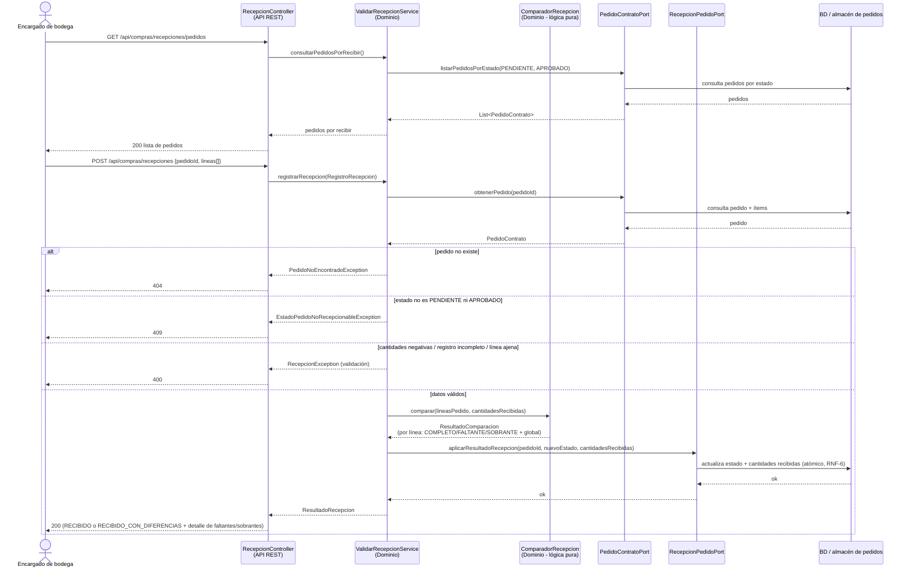

[← Volver al índice](arc42-template-ES.md)

# 6. Vista de Ejecución

Los escenarios 6.1–6.3 se derivan de las llamadas documentadas en el [diagrama de estructura compuesta](<../diagramas/plantuml/diagrama estructura compuesta>) (caja blanca de Facturación) y el [diagrama de componentes](../diagramas/plantuml/diagrama_componentes.plantuml); no existe un diagrama de secuencia dedicado para ellos, por lo que se narran a partir de esos dos diagramas. El escenario 6.4 sí cuenta con un diagrama de secuencia explícito, agregado por el equipo posteriormente en [`Vista de Procesos (4+1)/2. vista de procesos.jpg`](<../../Vista de Procesos (4+1)/2. vista de procesos.jpg>).

## 6.1 Escenario: Facturar venta de moto (RF-2.1)

1. Llega la solicitud de facturación (venta) al componente **Facturación**.
2. `GeneradorComprobante` invoca a `ConectorInventario.verificarDisponibilidad()`, que consulta al componente **Inventario** para confirmar que la unidad sigue disponible (RF-2.1.1).
3. `GeneradorComprobante` usa `ValidadorComision`, que invoca a `ConectorEmpleados.consultarComision()`, consultando al componente **Empleados** el porcentaje de comisión del vendedor (RF-2.3.1).
4. `GeneradorComprobante` calcula impuestos y accesorios (RF-2.1.2) y genera el comprobante en PDF (RF-2.1.3).

## 6.2 Escenario: Facturar orden de servicio de taller (RF-2.2)

1. Llega la solicitud de facturación (orden de taller) al componente **Facturación**.
2. Se registran los repuestos usados (RF-2.2.1); `ConectorInventario` invoca `descontarRepuesto()` sobre el componente **Inventario**, descontando el stock (RF-2.2.1.1).
3. Se registra la mano de obra del mecánico asignado (RF-2.2.2).

## 6.3 Escenario: Asignar mecánico a una orden de taller (RF-4.2)

Del [diagrama de componentes](../diagramas/plantuml/diagrama_componentes.plantuml): **Empleados** consume la operación `asignarMecanico()` expuesta por **Facturación** (sobre la entidad `OrdenTaller`, ver [Vista de Bloques](05_building_block_view.md#54-vista-lógica-diagrama-de-clases-y-objetos)).

1. Empleados verifica disponibilidad de taller (RF-4.2.1, paquete `AsignacionTaller`).
2. Empleados invoca `asignarMecanico()` sobre Facturación para vincular el mecánico disponible a la `OrdenTaller`.

## 6.4 Escenario: Registrar venta con facturación electrónica DIAN (Vista de Procesos, agregada posteriormente)

/2. vista de procesos.jpg>)

Este es un diagrama de secuencia **explícito**, agregado por el equipo después de los 11 diagramas UML originales — a diferencia de los escenarios 6.1–6.3, que se narran a partir de diagramas de componentes/estructura compuesta sin secuencia dedicada. Usa nomenclatura de la [Vista Lógica actualizada](05_building_block_view.md#541-vista-lógica-actualizada-agregada-posteriormente) (`Módulo Ventas`, no `Facturación`/`VentaMotos`):

1. **Vendedor** invoca `registrarVenta(vehiculoId, clienteId)` sobre **Módulo Ventas**.
2. **Módulo Ventas** invoca `verificarDisponibilidad(vehiculoId)` sobre **Módulo Inventario**, que consulta el stock en la **Base de Datos** y responde "stock disponible"; Módulo Ventas recibe `OK`.
3. **Módulo Ventas** guarda la venta y su detalle directamente en la **Base de Datos**.
4. **Módulo Ventas** invoca `descontarStock(vehiculoId)` sobre **Módulo Inventario**, que actualiza el stock en la **Base de Datos**.
5. **Módulo Ventas** invoca `generarFactura(ventaId)` sobre **Módulo Facturación**.
6. **Módulo Facturación** guarda la factura en la **Base de Datos**, y luego **envía la factura electrónica a DIAN de forma asíncrona** ("enviar factura electrónica (async)").
7. **DIAN** responde con el **CUFE / confirmación**.
8. **Módulo Facturación** responde `facturaGenerada` a **Módulo Ventas**, que a su vez responde `venta confirmada` al **Vendedor**.

Diferencias frente al escenario 6.1 (Facturar venta de moto, basado en el diagrama de estructura compuesta original):

- Este escenario nombra los subcomponentes `Módulo Ventas`/`Módulo Facturación` en vez de `GeneradorComprobante`/`ConectorInventario`/`ConectorEmpleados` — no queda claro si son la misma descomposición interna con otro nombre, o una reestructuración. [POR DEFINIR]
- Agrega explícitamente el paso de facturación electrónica a DIAN, ausente en 6.1 y en el diagrama de estructura compuesta original.
- No modela el cálculo de comisión del vendedor (`ConectorEmpleados.consultarComision()` en 6.1) — [POR DEFINIR si se omitió o si ya no aplica en este flujo].
- La llamada a DIAN se modela explícitamente como **asíncrona**, mientras el resto de la secuencia es síncrona — ver [4.7](04_solution_strategy.md#47-integración-con-sistemas-externos-dian-y-proveedores).

Este escenario, igual que el resto de esta sección, describe una **arquitectura propuesta a nivel de diseño**; no hay evidencia de una implementación en ejecución de este flujo.

## 6.5 Escenario: Validar recepción de un pedido (RF-3.6 / HU-15)

A diferencia de 6.1–6.4, **este escenario sí está implementado** (Java + Spring Boot, paquete
`com.andimotors.compras.recepcion`) y tiene diagrama de secuencia dedicado:
[`diagrama_secuencia_recepcion.plantuml`](../diagramas/plantuml/diagrama_secuencia_recepcion.plantuml).
Cubre el criterio de aceptación de HU-15: *"cuando el encargado de bodega registra las unidades
recibidas, el sistema las compara contra lo solicitado y señala faltantes o discrepancias"*.

Los participantes `PedidoContratoPort` y `RecepcionPedidoPort` son **puertos del contrato
temporal** (ver [5.7](05_building_block_view.md#57-estado-de-implementación-y-contrato-temporal-hu-12hu-15));
hoy los resuelve un adaptador mock en memoria y, al integrar HU-12, los resolverá un adaptador
JPA sobre la BD PostgreSQL sin cambiar esta secuencia.

### Reglas aplicadas en el flujo

| Paso | Regla |
|---|---|
| `obtenerPedido` | El pedido debe existir (→ 404) y estar `PENDIENTE`/`APROBADO` (→ 409). |
| Validación de entrada | Cantidades recibidas ≥ 0; el registro cubre cada línea del pedido exactamente una vez (→ 400). |
| `comparar` | Por línea: `recibida − solicitada` ⇒ `COMPLETO` (0), `FALTANTE` (<0), `SOBRANTE` (>0). |
| `aplicarResultadoRecepcion` | Global `COMPLETA` ⇒ estado `RECIBIDO`; `CON_DIFERENCIAS` ⇒ `RECIBIDO_CON_DIFERENCIAS`. Cambio de estado + cantidades en una sola operación atómica (RNF-6). |

---
[← Anterior: Vista de Bloques](05_building_block_view.md) · [Volver al índice](arc42-template-ES.md) · [Siguiente: Vista de Despliegue →](07_deployment_view.md)
