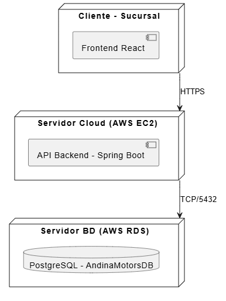

[← Volver al índice](arc42-template-ES.md)

# 7. Vista de Despliegue

## 7.1 Infraestructura — Nivel 1

Del [diagrama_despliegue.plantuml](../diagramas/plantuml/diagrama_despliegue.plantuml):

| Nodo | Contiene | Descripción |
|---|---|---|
| Cliente - Sucursal | Frontend React | Se ejecuta en el navegador del usuario, en la sucursal del concesionario. |
| Servidor Cloud (AWS EC2) | API Backend - Spring Boot | Concentra la lógica de negocio del ERP; desplegado en instancia cloud (ver [restricciones de arquitectura](02_architecture_constraints.md)). |
| Servidor BD (AWS RDS) | PostgreSQL - AndinaMotorsDB | Almacenamiento persistente de todos los módulos del ERP. |

**Conexiones**:

| Origen | Destino | Protocolo |
|---|---|---|
| Cliente - Sucursal | Servidor Cloud (AWS EC2) | HTTPS |
| Servidor Cloud (AWS EC2) | Servidor BD (AWS RDS) | TCP/5432 |

**Motivación**: desplegar el backend y la base de datos en AWS (EC2 + RDS) permite que la sucursal cliente acceda al mismo inventario en tiempo real (RNF-3 Escalabilidad), sin necesidad de infraestructura propia en el local.

Según [alcance.md](../alcance.md), este despliegue contempla una sola sucursal cliente conectada a un único servidor; el soporte multi-sucursal con sincronización en la nube entre varias sedes queda fuera del alcance actual.

## 7.2 Nivel 2

[PENDIENTE: no hay diagrama ni documentación de despliegue a mayor detalle (por ejemplo, contenedores Docker específicos, balanceo de carga o zonas de disponibilidad) en el repositorio, más allá de que Docker está listado como herramienta de despliegue en [requisitos/No funcionales.md](<../requisitos/No funcionales.md>)].

---
[← Anterior: Vista de Ejecución](06_runtime_view.md) · [Volver al índice](arc42-template-ES.md) · [Siguiente: Conceptos Transversales →](08_crosscutting_concepts.md)
